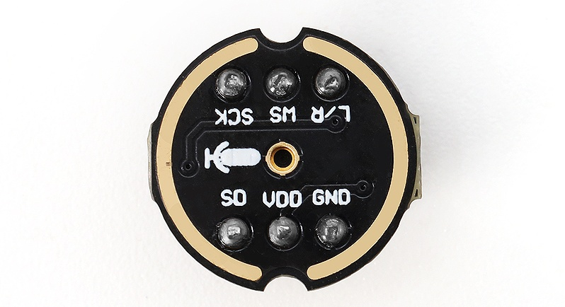
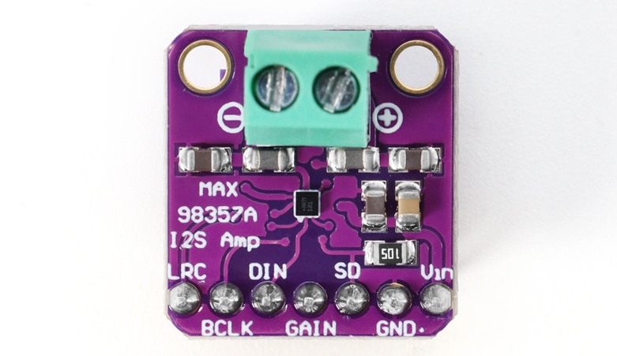
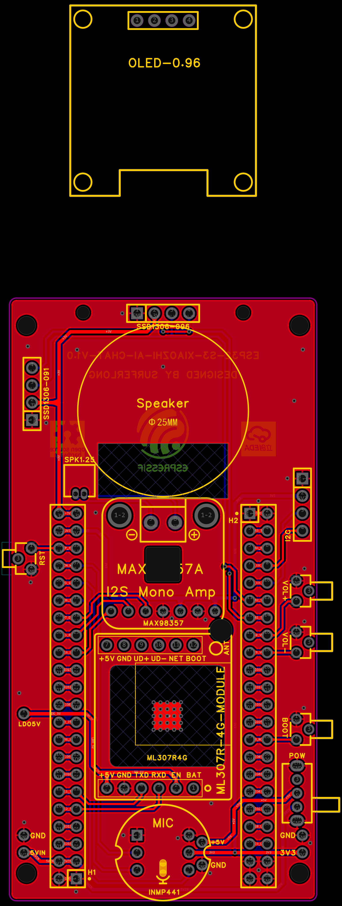
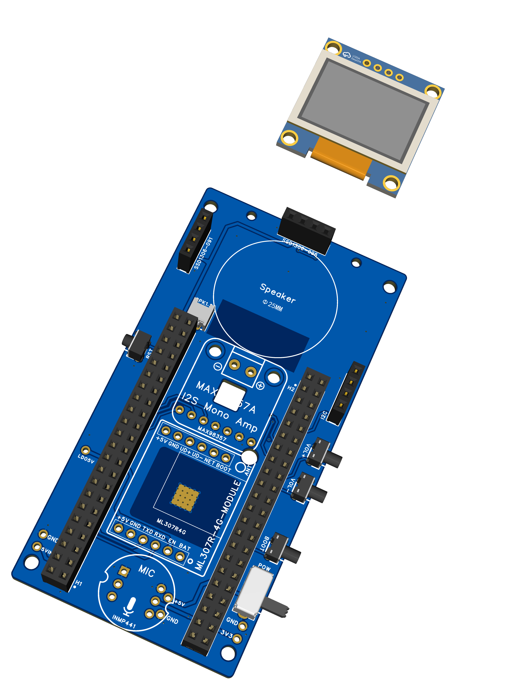
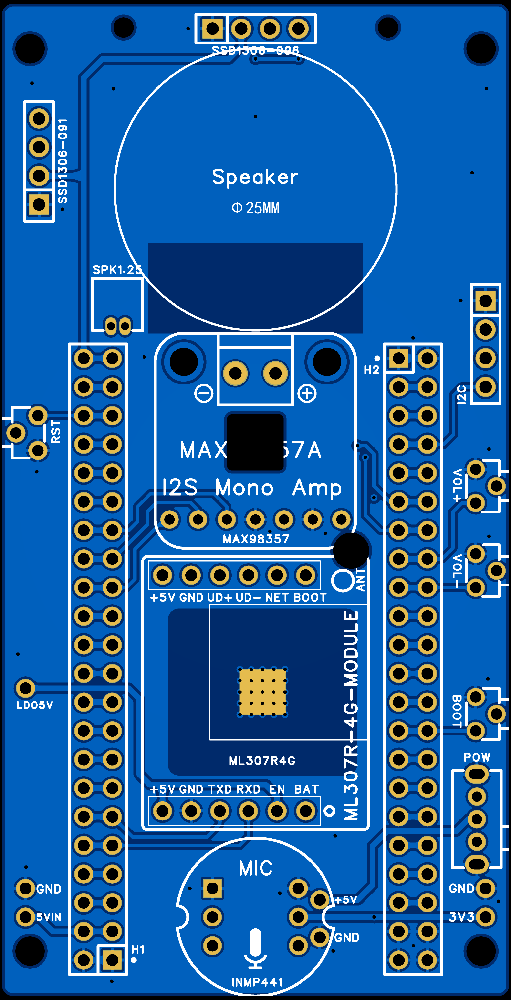

# DIY Pocket Size ESP32 AI Voice Assistant With Xiaozhi

<p align="center">
  
</p>

I've always been interested in voice assistants, but most of the time they are stuck inside phones or big smart speakers. I wanted something smaller… something I could actually keep on my desk or carry around with me.

So I decided to build my own using an ESP32. At first it felt a bit complicated, but after discovering Xiaozhi firmware, things became much easier. I didn't have to deal with heavy coding — just flash the firmware and set it up.

The result is a pocket-size AI voice assistant that can listen, respond, and even display information on a small screen. It feels more like a real device than just a project.

---

## What You Can Do With It

This little device can actually be used in many ways:

- 🏠 **Smart Home Assistant** — check weather or control devices
- 📚 **Learning Companion** — ask questions or get quick explanations
- 🎮 **Entertainment** — chatting, stories, or basic fun interactions
- 🛠️ **Development Platform** — experiment with AI and voice projects
- 🌐 **IoT Interface** — integrate inside bigger smart systems

---

## How It Works

<p align="center">
  
</p>

This project doesn't run AI directly on the ESP32. Instead, it uses cloud-based processing, which is why even a small board can act like a smart assistant.

**The working flow:**

1. You speak into the microphone
2. The ESP32 records your voice using I2S audio input
3. It sends that audio over WiFi to the Xiaozhi cloud
4. On the cloud side:
   - Your voice is converted into text (Speech-to-Text)
   - The AI model understands it and generates a reply
   - That reply is converted back into voice (Text-to-Speech)
5. The audio response is sent back to the ESP32
6. The ESP32 plays it through the speaker

**The ESP32 handles:**
- Recording and playing audio
- Connecting to WiFi
- Managing the device

**The actual AI thinking happens in the cloud.**

---

## Supplies

### Breadboard Version (for testing)

| Component | Description |
|-----------|-------------|
| ESP32-S3 DevKitC-1 | Main development board |
| INMP441 | Digital I2S microphone |
| MAX98357A | I2S audio amplifier |
| Speaker | 4Ω–8Ω, 2–3W |
| OLED Display | SSD1306, 0.91" or 0.96" |
| Push button | For interaction |
| Breadboard + jumper wires | For prototyping |

### PCB Version (compact build)

| Component | Part Number / Details |
|-----------|----------------------|
| ESP32-S3 | Main controller |
| INMP441 | Digital MEMS microphone |
| MAX98357A | I2S amplifier module |
| OLED Display | SSD1306 – HS96L03W2C03 (0.96") |
| Reset Button | K2-1109DE |
| Tactile Buttons (×3) | KH-4.5X4.5X6H (Boot, Vol+, Vol−) |
| Power Switch | SK12D07L3B |
| Female Headers | 2.54mm (for I2C / OLED / ESP32) |
| ESP32 Pin Headers | 2×22 pin |
| Speaker Connector | 1.25mm 2-pin – ZX-MX1.25 |

> PCB design credit: [surferlong](https://github.com/surferlong)

---

## Understanding the Hardware

Both the microphone and speaker use the **I2S interface**, making this a clean, all-digital audio system.

### ESP32-S3 DevKitC-1

<p align="center">
  
</p>

| Spec | Value |
|------|-------|
| CPU | Dual-core Xtensa LX7, up to 240 MHz |
| Wireless | Wi-Fi 802.11b/g/n, Bluetooth BLE |
| Flash | 8 MB |
| USB | Dual Type-C |
| GPIO Pins | 34 |
| Module | ESP32-S3-WROOM-1-N16 |

### INMP441 – Digital I2S Microphone

<p align="center">
  
</p>

A digital MEMS microphone with built-in ADC. Sends clean digital audio directly over I2S — no external ADC needed.

### MAX98357A – I2S Audio Amplifier

<p align="center">
  
</p>

| Spec | Value |
|------|-------|
| Supply Voltage | 2.5V – 5.5V |
| Output Power | 3.2W into 4Ω at 5V |
| Interface | I²S |
| THD+N | 0.1% typical |
| SNR | 90dB |
| Efficiency | Up to 92% |

Combines DAC + Amplifier in one module — takes I2S digital audio from the ESP32 and drives the speaker directly.

---

## Wiring

<p align="center">
  
</p>

<p align="center">
  
</p>

### INMP441 → ESP32

| INMP441 | ESP32 Pin |
|---------|-----------|
| VDD | 3.3V |
| GND | GND |
| WS | GPIO4 |
| SCK | GPIO5 |
| SD | GPIO6 |
| L/R | GND (mono / left channel) |

> ⚠️ Works on 3.3V only. Keep wiring short for better audio quality.

### MAX98357A → ESP32

| MAX98357A | ESP32 Pin |
|-----------|-----------|
| VIN | 3.3V |
| GND | GND |
| DIN | GPIO7 |
| BCLK | GPIO15 |
| LRC | GPIO16 |
| GAIN | GND |
| SD | 3.3V |
| SPK+ / SPK− | Speaker |

### OLED Display → ESP32

| OLED | ESP32 Pin |
|------|-----------|
| VCC | 3.3V |
| GND | GND |
| SDA | GPIO41 |
| SCL | GPIO42 |

---

## Breadboard Prototype

<p align="center">
  
</p>

<p align="center">
  
</p>

<p align="center">
  
</p>

---

## PCB Version

<p align="center">
  
</p>

<p align="center">
  
</p>

<p align="center">
  
</p>

<p align="center">
  
</p>

After testing on the breadboard, I moved to a PCB for a cleaner and more compact build. I used this open-source PCB design (full credit to: **surferlong**).

Ordered from **NextPCB** — received boards within about a week with great quality.

### PCB Assembly Order

1. Solder the female pin headers first (for ESP32 mounting)
2. Solder push buttons
3. Add smaller modules (microphone, etc.)
4. Mount the ESP32-S3 board on the headers
5. Solder the TP4056 charging module on the backside
6. Connect the speaker

---

## Flashing the Firmware

### Step 1 — Download Required Files

- **ESP Flash Download Tool**: [Espressif Flash Tool](https://docs.espressif.com/projects/esp-test-tools/en/latest/esp32/production_stage/tools/flash_download_tool.html)
- **Firmware file**: `Firmware/merged-binary.bin` (from this repository)

### Step 2 — Configure Flash Tool

1. Extract all downloaded files
2. Open ESP Flash Download Tool
3. Select chip type → **ESP32-S3**

### Step 3 — Flash the Firmware

1. Click `...` and select `Firmware/merged-binary.bin`
2. Set address to: **`0x0`**
3. Tick the checkbox next to the file
4. Select the correct **COM port**
5. Click **Erase** and wait for completion
6. Click **Start** and wait for **FINISH**

---

## WiFi Setup and Device Activation

### 1. Power On and Connect

After booting, the device creates a WiFi hotspot:
```
Xiaozhi-XXXX
```
Connect to it from your phone or laptop.

### 2. Open the Setup Page

In your browser, go to:
```
192.168.4.1
```

### 3. Connect to Your WiFi

- Select your WiFi network (**2.4GHz only**)
- Enter password and click **Connect**
- Device will restart automatically

### 4. Get the Device Code

After restarting, the device will speak (or display) a **6-digit code**.

### 5. Add Device to Xiaozhi

1. Go to 👉 **[http://xiaozhi.me](http://xiaozhi.me)**
2. Create an account or log in
3. Open **Console** → **Add Device**
4. Enter the 6-digit code

### 6. Customize Your Assistant

You can now customize:
- Name
- Language
- Voice
- Personality (fun, professional, etc.)
- AI model

---

## Testing

After setup, restart the device and wait for it to connect to WiFi. Then press the button and speak something like:

> *"Hello"* or *"What can you do?"*

**Expected behavior:**
- Microphone captures voice
- After a second, you hear a reply from the speaker
- OLED shows status or messages

**Troubleshooting:**
| Issue | Check |
|-------|-------|
| No response | WiFi connected? |
| Audio issues | I2S pin wiring |
| No sound | Speaker & amplifier connections |
| Boot issues | Stable power supply |

---

## Repository Structure

```
esp32-ai-pocket-assistant/
│
├── Firmware/
│   └── merged-binary.bin       # Pre-built firmware to flash
│
├── Gerber File/
│   ├── Gerber xiaozhi.zip       # PCB Gerber files (ready to order)
│   └── Gerber xiaozhi/          # Individual Gerber layers
│
├── STL File/
│   └── STL files/               # 3D printable enclosure files
│       ├── obj_1_Box - Sliding Cover - 42P - 0.91OLED.stl
│       ├── obj_2_Box - Sliding Cover - 44P - 0.91OLED.stl
│       ├── obj_4_Box - Sliding Cover - 44P - 0.96OLED.stl
│       ├── obj_7_Box - Sliding Cover - 42P - 0.96OLED.stl
│       └── ... (sliding covers for each variant)
│
├── Images/                      # Project photos and diagrams
│
├── Wiring Diagram/              # Circuit connection diagrams
│   ├── wiring.jpg
│   └── wiring2.png
│
└── README.md
```

---

## 3D Printable Enclosure

The `STL File/` folder contains printable enclosure files in multiple variants:

| File | Description |
|------|-------------|
| `obj_1_Box - Sliding Cover - 42P - 0.91OLED.stl` | Box for 42-pin board with 0.91" OLED |
| `obj_2_Box - Sliding Cover - 44P - 0.91OLED.stl` | Box for 44-pin board with 0.91" OLED |
| `obj_4_Box - Sliding Cover - 44P - 0.96OLED.stl` | Box for 44-pin board with 0.96" OLED |
| `obj_7_Box - Sliding Cover - 42P - 0.96OLED.stl` | Box for 42-pin board with 0.96" OLED |
| `obj_3/5/6/8_Sliding Cover - ...` | Matching sliding covers |

---

## Credits

- **Xiaozhi Firmware**: [Xiaozhi ESP32](https://github.com/78/xiaozhi-esp32)
- **PCB Design**: [surferlong](https://github.com/surferlong)
- **PCB Fabrication**: [NextPCB](https://www.nextpcb.com)

---

## License

This project is licensed under the MIT License — see the [LICENSE](LICENSE) file for details.

PCB design credits belong to the original creator (surferlong). Please respect the original open-source license of that design.
